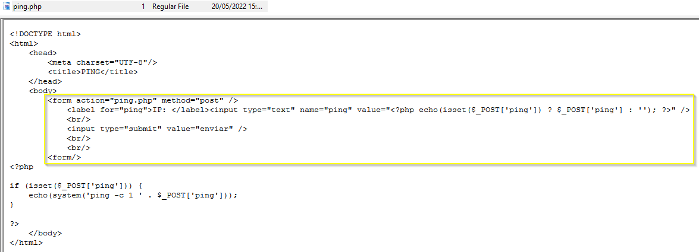

# Proyecto 5: Incident on Linux Server I - Anexo

## Índice

1. [Declaración de abstención y tacha](#1-declaración-de-abstención-y-tacha)
2. [Juramento de promesa](#2-juramento-de-promesa)
3. [Figuras](#3-figuras)
4. [Hallazgos](#4-hallazgos)

## 1. Declaración de abstención y tacha

Yo, Víctor Jiménez Corada, con identificación _011002-A_, en calidad de Perito Forense Informático, declaro formalmente lo siguiente:

1. Abstención

   No tengo interés directo ni indirecto en los hechos objeto del presente informe pericial, ni relación alguna con las partes involucradas que pueda comprometer mi imparcialidad, conforme a lo establecido en la normativa _ISO-27000_.

2. Tacha

   Declaro que no existen motivos de tacha que afecten mi idoneidad, independencia o credibilidad como peritos en este caso. No poseo vínculos familiares, laborales ni de cualquier otra índole con las partes intervinientes.

3. Confirmación de Imparcialidad

   Mis análisis, conclusiones y opiniones periciales se fundamentan exclusivamente en las evidencias digitales recibidas y en las metodologías técnicas reconocidas por la disciplina de informática forense, sin influencia externa de ningún tipo.

En virtud de lo anterior, asumo la responsabilidad de actuar con total objetividad y profesionalismo en la elaboración y presentación del presente informe.

## 2. Juramento de promesa

Yo, Víctor Jiménez Corada, identificado con _011002-A_, en calidad de Perito Forense Informático, bajo juramento, prometo solemnemente lo siguiente:

1. Realizar el análisis técnico del presente caso conforme a los principios de objetividad, veracidad y rigurosidad científica propios de la disciplina de informática forense.

2. Garantizar que todas las conclusiones presentadas en el informe pericial se sustenten exclusivamente en las evidencias digitales analizadas y las metodologías técnicamente válidas, sin alteraciones ni omisiones deliberadas.

3. Actuar de manera independiente e imparcial, sin recibir presiones, influencias externas o intereses personales que puedan comprometer la integridad de mi labor.

4. Cumplir con las disposiciones legales y éticas vigentes aplicables al ejercicio de la pericia forense en el marco del acuerdo, la confidencialidad de los datos y cumplimiento de los requisitos del proceso.

Declaro bajo juramento que honraré este compromiso en la ejecución de mis funciones como perito en este caso.

En Cádiz a 24 de Marzo de 2025

Fdo:

## 3. Figuras

- Figura 1. Verificación de hashes:

- Figura 2. Creación de `passwd.txt`:

## 4. Hallazgos

- Hallazgo 1:

| Campo                         | Valor                                                                             |
| ----------------------------- | --------------------------------------------------------------------------------- |
| Ruta de localización completa | /var/log/apache2/access.log                                                       |
| Contenido del fichero         |                                            |
| MAC time                      | **Modificado**: 20/05/2022 15:21:03 **Accedido**: 28/04/2010 21:19:51 **Creado**: |
| Tamaño lógico del fichero     | 3.494 bytes                                                                       |
| Valor hash del fichero (MD5)  | a71e80bd1ad541352d5907628f1bb3ce                                                  |
| Valor hash del fichero (SHA1) | 640b5541fb9d263389b923ad786701ab149f84f9                                          |

- Hallazgo 2:

| Campo                         | Valor                                                                             |
| ----------------------------- | --------------------------------------------------------------------------------- |
| Ruta de localización completa | /var/log/www/ping.php                                                             |
| Contenido del fichero         |                                        |
| MAC time                      | **Modificado**: 20/05/2022 15:09:37 **Accedido**: 20/05/2022 15:09:46 **Creado**: |
| Tamaño lógico del fichero     | 542 bytes                                                                         |
| Valor hash del fichero (MD5)  | d3f424335dac2d8af26ad3f0a99a1a7d                                                  |
| Valor hash del fichero (SHA1) | 525132ce24328226594b0f97d0ef2d3f8b7a422e                                          |

- Hallazgo 3:

| Campo                         | Valor                                                                             |
| ----------------------------- | --------------------------------------------------------------------------------- |
| Ruta de localización completa | /var/log/www/passwd.txt                                                           |
| Contenido del fichero         |                                |
| MAC time                      | **Modificado**: 20/05/2022 15:13:49 **Accedido**: 20/05/2022 15:13:49 **Creado**: |
| Tamaño lógico del fichero     | 1.626 bytes                                                                       |
| Valor hash del fichero (MD5)  | 7cd7b33f99cc526d01473b553e1042d5                                                  |
| Valor hash del fichero (SHA1) | 2d8c72a744c486342f5ec770ac27e8dd7b2f2ee0                                          |

---

Documento redactado por el perito forense informático Víctor Jiménez Corada.

Fdo:

