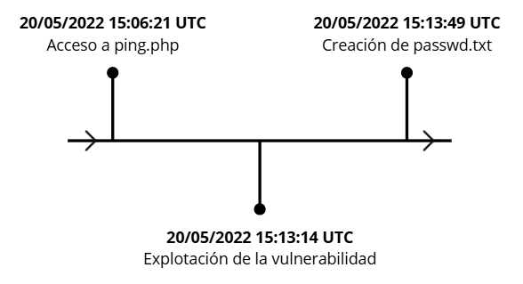

# Proyecto 5: Incident on Linux Server I - Informe Pericial

**Código**: P05

**Nombre**: Incident on Linux Server I

**Analista forense**: Víctor Jiménez

**Fecha**: 24/03/2025

## Índice

1. [Resumen Ejecutivo](#1-resumen-ejecutivo)
2. [Glosario de términos](#2-glosario-de-términos)
3. [Introducción](#3-introducción)  
   3.1. [Datos del analista](#31-datos-del-analista)  
   3.2. [Antecedentes](#32-antecedentes)  
   3.3. [Objetivos](#33-objetivos)  
   3.4. [Verificación](#34-verificación)
4. [Fuente de información](#4-fuente-de-información)  
   4.1. [Cadena de custodia](#41-cadena-de-custodia)
5. [Análisis](#5-análisis)  
   5.1. [Herramientas](#51-herramientas)  
   5.2. [Metodología](#52-metodología)
6. [Procesos](#6-procesos)  
   6.1. [Vulnerabilidad explotada](#61-vulnerabilidad-explotada)  
   6.2. [Información del atacante](#62-información-del-atacante)  
   6.3. [Datos exfiltrados](#63-datos-exfiltrados)  
   6.4. [Registros del archivo original](#64-registros-del-archivo-original)
7. [Línea de tiempo](#7-línea-de-tiempo)
8. [Limitaciones](#8-limitaciones)
9. [Propuestas de mitigación](#9-propuestas-de-mitigación)
10. [Conclusión](#10-conclusión)
11. [Anexos](#11-anexos)

## 1. Resumen Ejecutivo

El presente informe detalla un análisis forense informático realizado tras la detección de un incidente de seguridad en un servidor web. La investigación reveló que un atacante explotó una vulnerabilidad de Cross-Site Scripting (XSS) en un archivo `ping.php`, lo que permitió la exfiltración de datos sensibles. A través de herramientas especializadas, se identificaron la dirección IP, el cliente y el sistema operativo utilizados por el atacante, así como los archivos comprometidos.

## 2. Glosario de términos

- Cross-Site Scripting (XSS): Vulnerabilidad que permite la inyección de scripts maliciosos en páginas web para ejecutar código en el navegador de las víctimas.
- Sanitización de Entradas: Técnica de seguridad que limpia y filtra datos de entrada para prevenir ataques.
- Exfiltración de Datos: Robo de información confidencial desde un sistema comprometido.
- Content Security Policy (CSP): Mecanismo de seguridad web que restringe la ejecución de scripts no autorizados.
- Hash SHA-256: Algoritmo criptográfico utilizado para verificar la integridad de archivos.
- Memoria RAM: Componente de almacenamiento volátil donde se guardan datos temporales de un sistema en ejecución.

## 3. Introducción

### 3.1 Datos del analista

El perito forense informático especializado en ciberseguridad en entornos de las tecnologías de la información responsable de la redacción de este informe es Víctor Jiménez Corada. Sus datos son los siguientes:

- Numero de identificación: _011002-A_
- Correo electrónico: <vjimcor955@g.educaand.es>

### 3.2. Antecedentes

En un día de trabajo común, una alarma rompió el silencio en el centro de datos. Vicente, un técnico, recibió una alerta sobre un posible incidente de seguridad: la extracción de datos sensibles desde un servidor a través de una aplicación web aparentemente segura.

Esa aplicación, creada para escanear redes de forma remota, escondía una vulnerabilidad crítica.

### 3.3. Objetivos

El objetivo del análisis forense es seguir el rastro digital dejado por el intruso, asi como identificar su identidad y la motivación que existía detrás del ataque. Esto incluye los siguientes apartados:

- Identificar la vulnerabilidad en la aplicación web que fue explotada por el atacante.
- Determinar la IP, el cliente y el sistema operativo utilizado por el atacante.
- Descubrir qué datos fueron exfiltrados del servidor comprometido.
- Analizar por qué el archivo original no muestra actividad durante el incidente.
- Proponer soluciones para reparar la vulnerabilidad explotada.

### 3.4. Verificación

Como se puede ver en la Figura 1 del anexo adjunto, se ha procedido al cálculo de la imagen de disco del servidor comprometido, la captura de memoria RAM y el perfil de la memoria, coincidiendo estos con los de los hashes proporcionados.

## 4. Fuente de información

Se nos ha proporcionado una imagen de disco del servidor comprometido, una captura de memoria RAM, el perfil de la memoria y un archivo de hashes para verificar la integridad de las evidencias.

### 4.1 Cadena de custodia

#### 1. Información del caso

| **Sección**           | **Campo**                            |
| --------------------- | ------------------------------------ |
| Número de Caso        | P05                                  |
| Tipo de Investigación | Análisis Forense                     |
| Fecha de Adquisición  | 13 de marzo de 2025, 08:00           |
| Lugar de Adquisición  | C/ Amiel, s/n – 11012, Cádiz (Cádiz) |

#### 2. Descripción de la evidencias

| **Sección**                           | **Campo**                                                        |
| ------------------------------------- | ---------------------------------------------------------------- |
| Tipo de Dispositivo                   | Perfil de la Memoria, 337 KB (345.635 bytes)                     |
| Nombre del archivo                    | perfil_memoria.zip                                               |
| Hash SHA-256 de la Evidencia Original | 18b30b973223b8ab233aa1581bccd35bef6c678b29e671b3fe3a7ee5ea24b076 |

| **Sección**                           | **Campo**                                                        |
| ------------------------------------- | ---------------------------------------------------------------- |
| Tipo de Dispositivo                   | Memoria RAM comprimida, 214 MB (224.424.789 bytes)               |
| Nombre del archivo                    | captura_ram.lime.zip                                             |
| Hash SHA-256 de la Evidencia Original | 632d3d95260753029d7c9ade15e0dcab69b8fe7eb08d7001d9f923b22ddf003f |

| **Sección**                           | **Campo**                                                        |
| ------------------------------------- | ---------------------------------------------------------------- |
| Tipo de Dispositivo                   | Memoria RAM, 0,99 GB (1.073.282.112 bytes)                       |
| Nombre del archivo                    | captura_ram.lime                                                 |
| Hash SHA-256 de la Evidencia Original | 0f5d751208b08450e298b8d27f22451dd2ae158dfc1cb80b974f360e9a88ff05 |

| **Sección**                           | **Campo**                                                        |
| ------------------------------------- | ---------------------------------------------------------------- |
| Tipo de Dispositivo                   | Imagen de disco comprimida, 1,54 GB (1.656.779.434 bytes)        |
| Nombre del archivo                    | imagen_disco.dd.zip                                              |
| Hash SHA-256 de la Evidencia Original | b0189203fa682fd086ed3c52a3723ac46ab896a2fb8e4daf49ed6228bc7d3b76 |

| **Sección**                           | **Campo**                                                        |
| ------------------------------------- | ---------------------------------------------------------------- |
| Tipo de Dispositivo                   | Imagen de disco, 8,00 GB (8.589.934.592 bytes)                   |
| Nombre del archivo                    | imagen_disco.dd                                                  |
| Hash SHA-256 de la Evidencia Original | 9f2b2dace6cfebec1b6f956fc231e199c00f39e05d50286b8f284043537d65d9 |

## 5. Análisis

### 5.1. Herramientas

Las herramientas usadas durante las investigación y sus versiones son las siguientes:

- FTKImages 4.2.0.13: Para ver el contenido de la imagen de disco.
- strings: Herramienta en Linux que permite ver el contenido bruto de la captura de memoria RAM.
- hashChecker.py: Programa que calcula los hashes de las evidencias proporcionadas y los compara con los hashes dados.

### 5.2. Metodología

La metodología aplicada ha sido analizar la imagen del disco en busca de log y archivos sospechosos, una vez identificados los indicios del ataque, revisar la memoria RAM en busca de procesos sospechosos y por ultimo recopilar toda la información relevante a la explotación de la vulnerabilidad.

## 6. Procesos

### 6.1. Vulnerabilidad explotada

Para identificar la vulnerabilidad explotada en la aplicación web, se llevó a cabo una revisión del archivo `ping.php`, ubicado en el directorio `/var/www`.

Durante el análisis, se determinó que el ataque se basó en una vulnerabilidad de tipo Cross-Site Scripting (XSS).

### 6.2. Información del atacante

Con el objetivo de identificar al atacante, se accedió a los registros del servidor web, específicamente al archivo `access.log` ubicado en `/var/log/apache2`.

Del análisis de los registros, se obtuvo la dirección IP utilizada por el atacante (`192.168.1.6`), el cliente empleado (`Mozilla/5.0`) y el sistema operativo en uso (`Linux x86_64`). Estos datos permitieron contextualizar el entorno desde el cual se llevó a cabo el ataque.

### 6.3. Datos exfiltrados

Para determinar qué información fue extraída del sistema comprometido, se realizó un análisis de la memoria RAM mediante la herramienta strings, aplicando un filtro basado en la IP del servidor (`192.168.1.28`).

Como resultado, se identificó un proceso en el que el atacante creó un archivo denominado `passwd.txt` generado a partir de la información contenida en el archivo `/etc/passwd`. El archivo generado por el atacante puede encontrarse en el directorio `/var/www` de la imagen de disco.

### 6.4. Registros del archivo original

El archivo original, `/etc/passwd`, no mostró actividad durante el incidente ya que el atacante utilizó el comando `cat` para leer el contenido del archivo y redirigir la salida a `passwd.txt`.

Al no modificarse directamente el archivo original, este no registró cambios ni eventos en los registros del sistema.

## 7. Línea de tiempo

## 8. Limitaciones

La única limitación encontrada durante el análisis ha sido la imposibilidad de analizar la memoria RAM con herramientas mas accesibles debido a la falta del perfil de la maquina en cuestión.

## 9. Propuestas de mitigación

Se ha verificado que la aplicación web no contaba con mecanismos adecuados de sanitización de entradas, lo que permitió la inyección de scripts maliciosos.

En vista de corregir esta vulnerabilidad se recomienda implementar filtrado y sanitización de entradas de usuario utilizando `htmlspecialchars()` para evitar la ejecución de código malicioso en las respuestas del servidor.

Ademas de ello, otras acciones recomendadas son aplicar un Content Security Policy (CSP) para restringir la ejecución de scripts no autorizados y utilizar validación en el lado del servidor para evitar que la seguridad dependa unicamente de la validación del lado del cliente.

## 10. Conclusión

El análisis confirma que el ataque se produjo a través de una vulnerabilidad XSS en una aplicación web, permitiendo al atacante acceder a información confidencial. Se logró identificar los datos del intruso y los archivos comprometidos. Como resultado del estudio, se recomienda implementar medidas correctivas, como la sanitización de entradas y el uso de una política de seguridad de contenido (CSP), para evitar futuras explotaciones similares.

## 11. Anexos

La Declaración de abstención y tacha, el Juramento de promesa, así como las figuras y hallazgos relacionados con el caso, se encuentran recogidos en el siguiente anexo:

[Proyecto 5: Incident on Linux Server I - Anexo](./P05-Anexos_IncidentLinuxServer-VJC.md)

---

Documento redactado por el perito forense informático Víctor Jiménez Corada.

Fdo:

