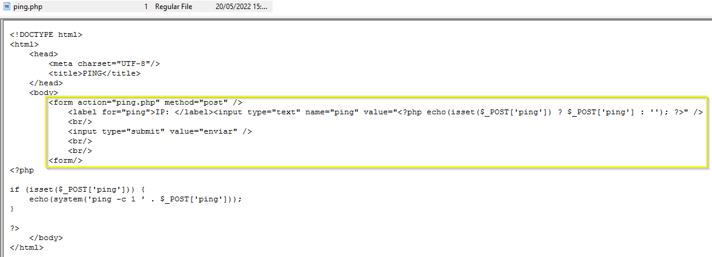
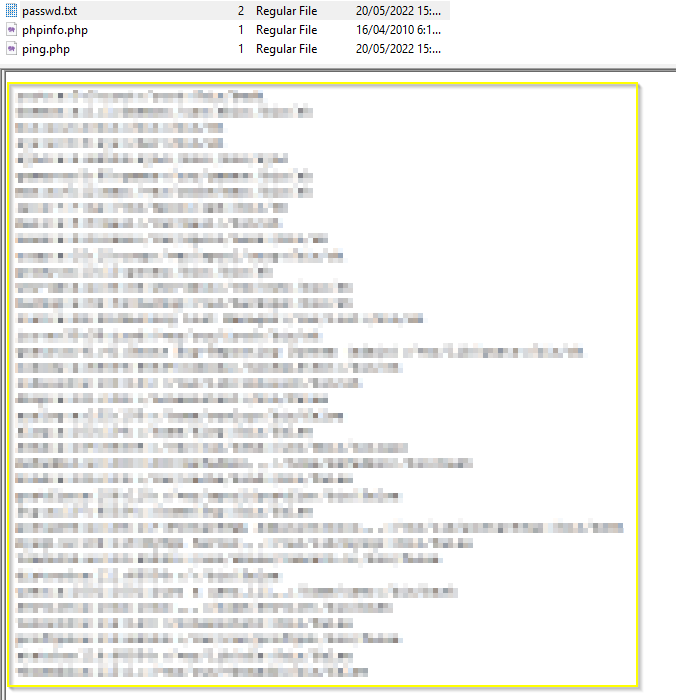

# Proyecto 5: Incident on Linux Server I - Investigación

En esta sección, nos embarcaremos en una búsqueda exhaustiva de evidencia digital que arroje luz sobre el incidente de seguridad. A través del análisis de las adquisiciones aportadas por el cliente intentaremos responder a las siguientes preguntas:

1. Identificar la vulnerabilidad en la aplicación web que fue explotada por el atacante.

   Como se puede ver en el archivo `ping.php` situado en el directorio `/www`, podemos ver que la vulnerabilidad que se explotó fue Cross-Site Scripting (XSS):

   

2. Determinar la IP, el cliente y el sistema operativo utilizado por el atacante durante el ataque.

   Como podemos ver en los logs del servidor web, en el archivo `access.log` del directorio `/var/log/apache2`, los datos del ataque son los siguientes:

   

   - IP: 192.168.1.6
   - Cliente: Mozilla/5.0
   - OS: Linux x86_64

3. Descubrir qué datos fueron exfiltrados del servidor comprometido.

   Haciendo una búsqueda con `strings` en la memoria RAM filtrando por ip del servidor "192.168.1.28" podemos ver sus procesos, entre los que se puede ver un input en el que el atacante crea el archivo `passwd.txt` a partir del contenido de `/etc/passwd`:

   

   El contenido de `passwd.txt` se puede ver en la imagen del disco:

   

4. Analizar por qué el archivo original no muestra actividad durante el incidente.

   El archivo original no muestra actividad porque el atacante unicamente lee el archivo con el comando `cat` y redirecciona la salida del comando a un archivo de texto, lo que no modifica el archivo original.

5. Proponer soluciones para reparar la vulnerabilidad explotada.

   Para protegerse de ataques Cross-Site Scripting (XSS), se recomienda filtrar las entradas de los usuarios usando `htmlspecialchars()` para evitar la ejecución de código en la respuesta.
